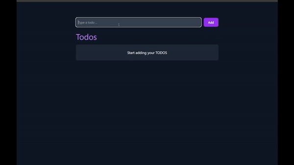

# Todo Redux

> A simple todo app using Redux toolkit + React + Typescript

## Author

[Asmaa Hamid](https://linktr.ee/asmaahamid02)

## Demo



## Features

- Add todo
- Remove todo
- Toggle todo
- Edit todo

## Tech Stack

- React
- Redux Toolkit
- Typescript
- Tailwind CSS

## How to run

1. Clone the repository

   ```bash
   #ssh
   git clone git@github.com:asmaahamid02/todo-redux.git
   #https
   git clone https://github.com/asmaahamid02/todo-redux.git
   ```

2. Install dependencies

   ```bash
   npm install
   ```

3. Run the app

   ```bash
   npm run dev
   ```

4. Open the app in your browser
